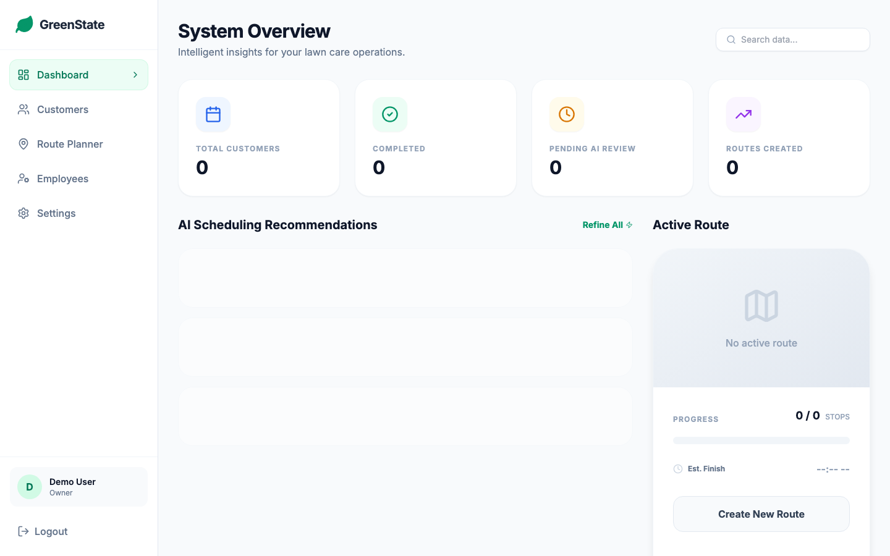
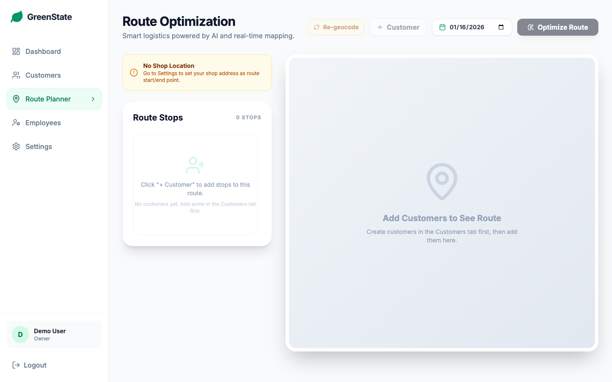
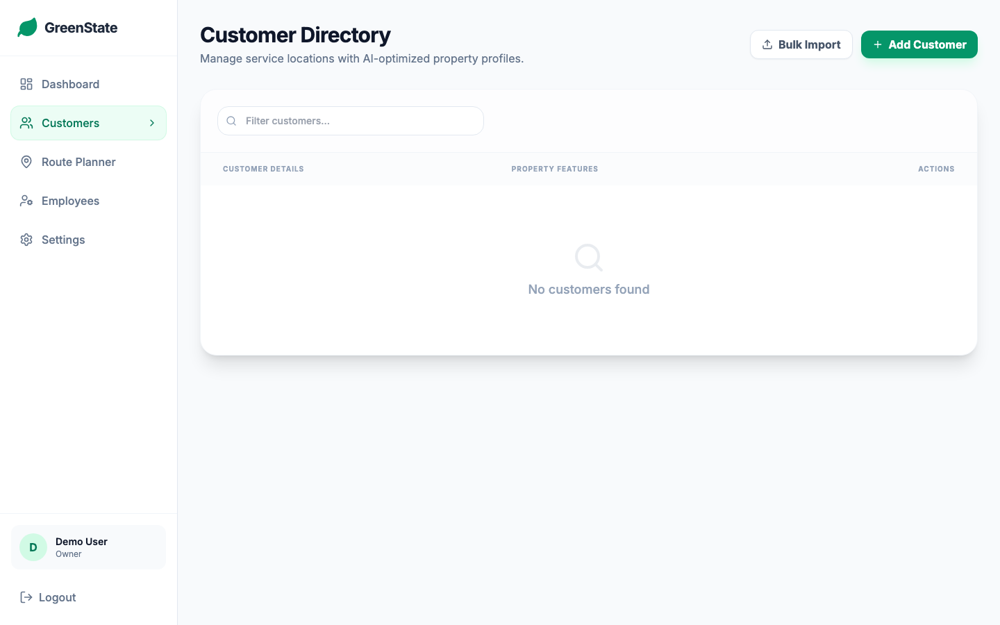

<h1 align="center">Grounds Crew CRM</h1>

<p align="center">
  <strong>Intelligent lawn care management and route optimization for landscaping businesses</strong>
</p>

<p align="center">


</p>

<p align="center">
  A comprehensive CRM solution designed specifically for lawn care and landscaping companies. Manage customers, optimize service routes, track employees, and leverage AI-powered weather insights to maximize efficiency and profitability.
</p>

<p align="center">
  <a href="#features">Features</a> •
  <a href="#screenshots">Screenshots</a> •
  <a href="#quick-start">Quick Start</a> •
  <a href="#configuration">Configuration</a> •
  <a href="#tech-stack">Tech Stack</a>
</p>

---

## Features

- **Customer Management** - Complete customer profiles with service history, contact info, and property details
- **Route Optimization** - AI-powered route planning with shop location as start/end point
- **Interactive Mapping** - Real-time map visualization with Leaflet and Google Maps integration
- **Google Maps Geocoding** - Accurate address-to-coordinates conversion for precise mapping
- **Employee Management** - Track crew members, roles, and assignments
- **Weather Intelligence** - AI-powered weather insights via Google Gemini for optimal scheduling
- **Shop Location** - Configure your business location as the starting/ending point for all routes
- **Service Tracking** - Track mowing, fertilizing, leaf removal, and snow removal services
- **Duration Estimates** - Per-service time estimates for accurate route planning
- **CSV Import** - Bulk import customers from spreadsheets
- **Responsive Design** - Works seamlessly on desktop and mobile devices
- **User Authentication** - Secure login and registration system

## Screenshots

<p align="center">
  
  <br/>
  <em>Dashboard with AI Weather Intelligence</em>
</p>

<p align="center">
  
  <br/>
  <em>Route Optimization with Interactive Map</em>
</p>

<p align="center">
  
  <br/>
  <em>Customer Management Interface</em>
</p>

## Tech Stack

### Frontend
- **React 18** - Modern UI framework with hooks
- **TypeScript** - Type-safe development
- **Vite** - Fast build tooling
- **Tailwind CSS** - Utility-first styling
- **Leaflet** - Interactive mapping
- **Lucide Icons** - Beautiful icon library

### APIs & Services
- **Google Maps Geocoding API** - Address-to-coordinates conversion
- **Google Gemini AI** - Weather intelligence and scheduling recommendations
- **OpenStreetMap** - Map tiles

### Infrastructure
- **Docker** - Containerized deployment
- **Nginx** - Production web server
- **LocalStorage** - Client-side data persistence

## Quick Start

### Prerequisites
- Docker and Docker Compose
- Google Maps API key (for geocoding)
- Google Gemini API key (optional, for weather insights)

### Installation

1. **Clone the repository**
   ```bash
   git clone https://gitea.my-house.dev/joe/Grounds-Crew-CRM.git
   cd Grounds-Crew-CRM
   ```

2. **Configure environment variables**

   Copy the example environment file and add your API keys:
   ```bash
   cp .env.example .env.local
   ```

   Edit `.env.local` with your API keys:
   ```
   VITE_GOOGLE_MAPS_API_KEY=your_google_maps_api_key
   API_KEY=your_gemini_api_key
   ```

3. **Build and run with Docker**
   ```bash
   docker compose up -d --build
   ```

4. **Access the application**

   Open your browser to `http://localhost:47392`

## Configuration

### Environment Variables

| Variable | Description | Required |
|----------|-------------|----------|
| `VITE_GOOGLE_MAPS_API_KEY` | Google Maps Geocoding API key | Yes |
| `API_KEY` | Google Gemini API key for weather AI | No |

### Shop Location Setup

1. Log in to the application
2. Navigate to **Settings** in the sidebar
3. Enter your shop/office address
4. Click **Save Shop Location**

The shop location will be automatically used as the starting and ending point for all optimized routes.

## Usage

### Managing Customers

1. Navigate to **Customers** in the sidebar
2. Click **+ New Customer** to add a customer
3. Fill in contact info, address, and service preferences
4. Customer addresses are automatically geocoded for mapping

### Planning Routes

1. Navigate to **Route Planner** in the sidebar
2. Click **+ Customer** to add stops to your route
3. Select customers from the list
4. Click **Optimize Route** to calculate the most efficient path
5. Click **Open in Google Maps** for turn-by-turn navigation

### Importing Customers

1. Navigate to **Customers**
2. Click **Import CSV**
3. Upload a CSV file with columns: Name, Street, City, State, Zip, Email, Phone
4. Review and confirm the import

## Development

### Local Development

```bash
# Install dependencies
npm install

# Start development server
npm run dev

# Build for production
npm run build
```

### Project Structure

```
Grounds-Crew-CRM/
├── components/           # React components
│   ├── Dashboard.tsx     # Main dashboard with weather AI
│   ├── CustomerList.tsx  # Customer management
│   ├── RoutePlanner.tsx  # Route optimization
│   ├── RouteMap.tsx      # Interactive Leaflet map
│   ├── EmployeeList.tsx  # Employee management
│   ├── Settings.tsx      # Shop location config
│   └── Layout.tsx        # App layout/navigation
├── services/
│   ├── storageService.ts # LocalStorage data layer
│   ├── geocodingService.ts # Google Maps geocoding
│   └── geminiService.ts  # AI weather insights
├── types.ts              # TypeScript interfaces
├── utils/
│   └── addressUtils.ts   # Address formatting helpers
├── App.tsx               # Main application
├── Dockerfile            # Container build
├── docker-compose.yml    # Container orchestration
└── nginx.conf            # Production server config
```

## API Keys

### Google Maps API

1. Go to [Google Cloud Console](https://console.cloud.google.com/)
2. Create a new project or select existing
3. Enable **Geocoding API**
4. Create credentials (API key)
5. Restrict the key to Geocoding API for security

### Google Gemini API

1. Go to [Google AI Studio](https://makersuite.google.com/app/apikey)
2. Create an API key
3. Add to `.env.local`

## License

MIT License - See [LICENSE](LICENSE) for details.

---

<p align="center">
  Built with React, TypeScript, and Tailwind CSS
</p>
